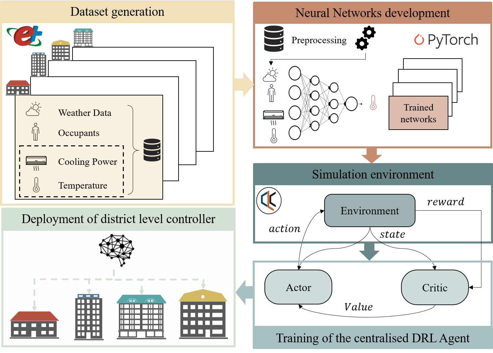
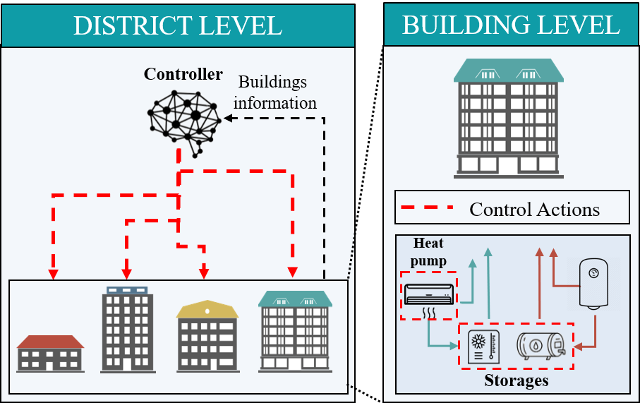
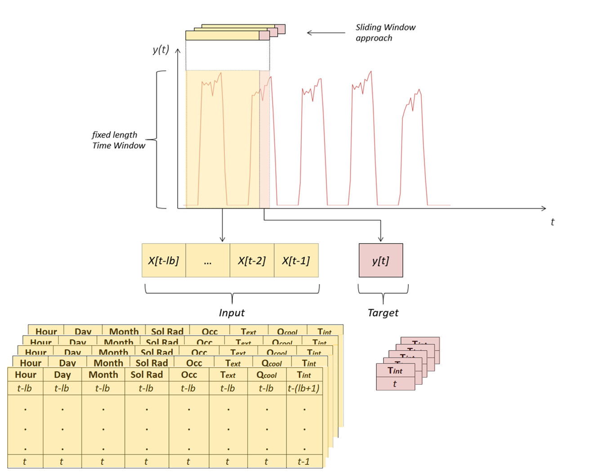

<!-- PROJECT SHIELDS -->
<!--
*** I'm using markdown "reference style" links for readability.
*** Reference links are enclosed in brackets [ ] instead of parentheses ( ).
*** See the bottom of this document for the declaration of the reference variables
*** for contributors-url, forks-url, etc. This is an optional, concise syntax you may use.
*** https://www.markdownguide.org/basic-syntax/#reference-style-links
-->

<!-- PROJECT LOGO -->
<br />
<p align="center">
  <a href="https://github.com/baeda-polito/3DEM/images/baedalogo.png">
    
  </a>
  <p align="center">
  </p>

  <h3 align="center">3DEM Data-Driven District Energy Management</h3>

  <p align="center">
    3DEM is an open source OpenAI Gym environment built on top of Citylearn (reference) for the implementation of 
    Multi-Agent Reinforcement Learning (RL) for building energy coordination and demand response in cities. 
    The peculiarity of the environment lies in the ability to simulate internal building dynamics of multiple buildings
     using data-driven models (DNNs). The aim is to ease the deployment of data-driven controller that can consider 
     internal building environment and coordination and cooperation among multiple buildings.  The goal is to ease the
      comparison of i) data-driven models to simulate building dynamics ii) data-driven controllers for district 
      energy management.
    <br />
    <a href="https://github.com/baeda-polito/3DEM"><strong>Explore the docs »</strong></a>
    
  </p>
</p>

## Description
Districts and cities have periods of high demand for electricity, which raise electricity prices and the overall cost of the power distribution networks. Flattening, smoothening, and reducing the overall curve of electrical demand helps reduce operational and capital costs of electricity generation, transmission, and distribution networks. Demand response is the coordination of electricity consuming agents (i.e. buildings) in order to reshape the overall curve of electrical demand.
Furthermore, building thermal mass can be used as an additional source of energy flexibility, if properly harnessed. Furthermore, demand response should not influence users comfort, requiring for a precise representation of the internal environment. 3DEM allows the easy implementation of reinforcement learning agents in a multi-agent setting to control HVAC and storage of multiple buildings, with the aim to reshape their aggregated curve of electrical demand, while ensuring users comfort. 
Currently, 3DEM allows controlling the storage of domestic hot water (DHW), chilled water and HVAC (for sensible cooling and dehumidification). 3DEM also includes models of air-to-water heat pumps, electric heaters, solar photovoltaic arrays, and pre-computed energy loads of the buildings, that can be used as benchmarks for indoor environment temperature evolution.

<br />
<p align="center">
  <a href="https://github.com/baeda-polito/3DEM/images/framework.png">
    
  </a>
  <p align="center">
  </p>
## Dependencies
3DEM requires the installation of the following Python libraries:

- gym==0.17.2
- numpy==1.18.4
- pandas==1.2.1
- pandoc==1.0.2
- pathlib==1.0.1
- Pillow==7.1.2
- scikit-learn==0.23.1
- scipy==1.5.2
- sklearn==0.0
- stable-baselines==2.10.0
- tensorboard==1.14.0
- tensorflow==1.14.0
- tensorflow-estimator==1.14.0
- torch==1.6.0
- torchvision==0.7.0
- utils==1.0.1

3DEM may still work with some earlier versions of these libraries, but we have tested it with those.

## Files
    main.py

    main.ipynb

    citylearn_3dem.py

    energy_models.py
    
    functions.py

    agent.py

    reward_function.py
    
    data

        └── Climate_Zone_1

            ├── building_attributes.json

            ├── electricity_price.csv

            ├── min.csv
            
            ├── max.csv

            ├── weather_data.csv

            └── Building_i.csv

    building_models

        └── Building_i.pth


- [main.py](/main.py): Example of the implementation of a reinforcement learning agent (centralized SAC) for the four buildings in 3DEM.
- [buildings_state_action_space.json](/buildings_state_action_space.json): json file containing the possible states and actions for every building, from which users can choose.
- [building_dynamics_state_space.json](/buildings_dynamics_state_space.json): json file containing the possible building dynamics states for every building, from which users can choose.
- [building_attributes.json](/data/building_attributes.json): json file containing the attributes of the buildings and which users can modify.
- [citylearn_3dem.py](/citylearn_3dem.py): Contains the ```CityLearn_3dem``` environment and the functions ```building_loader()``` and ```autosize()```
- [energy_models.py](/energy_models.py): Contains the classes ```Building```, ```HeatPump```,```EnergyStorage``` and ```Building Dynamic```, which are called by the ```CityLearn_3dem``` class.
- [agent.py](/agent.py): Implementation of the SAC algorithm RL algorithm. This file must be modified with any other RL implementation, which can then be run in the [main.ipynb](/main.ipynb) jupyter lab file or the [main.py](/main.py) file.
- [functions.py](/functions.py): Contains useful function to evaluate 3DEM KPIs and discomfort metrics,
- [reward_function.py](/reward_function.py): Contains the reward function that wraps and modifies the rewards obtained from ```CityLearn_3dem```. This function can be modified by the user in order to minimize the cost function of ```CityLearn_3dem```.

### Classes
- CityLearn_3dem
  - Building
    - BuildingDynamics
    - HeatPump
    - ElectricHeater
    - EnergyStorage


<br />
<p align="center">
  <a href="https://github.com/baeda-polito/3DEM/images/methodology.png">
    
  </a>
  <p align="center">
  </p>
  
### CityLearn_3dem
This class of type OpenAI Gym Environment contains all the buildings and their subclasses.
- CityLearn_3dem attributes (all in kWh)
  - ```net_electric_consumption```: district net electricity consumption
  - ```net_electric_consumption_no_storage```: district net electricity consumption if there were no cooling and DHW storage
  - ```net_electric_consumption_no_pv_no_storage```: district net electricity consumption if there were no cooling, DHW storage and PV generation
  - ```electric_consumption_dhw_storage```: electricity consumed in the district to increase DHW energy storage (when > 0) and electricity that the decrease in DHW energy storage saves from consuming in the district (when < 0).
  - ```electric_consumption_cooling_storage```: electricity consumed in the district to increase cooling energy storage (when > 0) and electricity that the decrease in cooling energy storage saves from consuming in the district (when < 0).
  - ```electric_consumption_dhw```: electricity consumed to satisfy the DHW demand of the district
  - ```electric_consumption_cooling```: electricity consumed to satisfy the cooling demand of the district
  - ```electric_consumption_appliances```: non-shiftable electricity consumed by appliances
  - ```electric_generation```: electricity generated in the district 
- CityLearn_3dem specific methods
  - ```get_state_action_spaces()```: returns state-action spaces for all the buildings
  - ```next_hour()```: advances simulation to the next time-step
  - ```get_building_information()```: returns attributes of the buildings that can be used by the RL agents (i.e. to implement building-specific RL agents based on their attributes, or control buildings with correlated demand profiles by the same agent)
  - ```get_baseline_cost()```: returns the costs of a Rule-based controller (RBC), which is used to divide the final cost by it.
  - ```cost()```: returns the normlized cost of the enviornment after it has been simulated. cost < 1 when the controller's performance is better than the RBC.
- Methods inherited from OpenAI Gym
  - ```step()```: advances simulation to the next time-step and takes an action based on the current state
  - ```_get_ob()```: returns all the states
  - ```_terminal()```: returns True if the simulation has ended
  - ```seed()```: specifies a random seed

### Building
The DHW of the buildings has been pre-computed and obtained from EnergyPlus. 
The DHW and cooling supply systems are sized such that the DHW and cooling demands are always satisfied thanks to a safety factor.
CityLearn_3dem automatically sets constraints to the actions from the controllers to guarantee that the DHW is satisfied.
On the other hand, the cooling demand is not pre-computed and it is chosen by the agent, so that the internal temperature is directly affected by the chosen action.
Energy balances ensure that the cooling energy supplied to the building and to the storage is smaller than the heat pump capacity.
The file building_attributes.json contains the attributes of each building, which can be modified. We do not advise to modify the attributes Building -> HeatPump -> nominal_power and Building -> ElectricHeater -> nominal_power from their default value "autosize", as they guarantee that the DHW and cooling demand are always satisfied.
- Building attributes (all in kWh)
  - ```cooling_demand_building```: demand for cooling energy to cool down and dehumidify the building
  - ```dhw_demand_building```: demand for heat to supply the building with domestic hot water (DHW)
  - ```electric_consumption_appliances```: non-shiftable electricity consumed by appliances
  - ```electric_generation```: electricity generated by the solar panels
  - ```electric_consumption_cooling```: electricity consumed to satisfy the cooling demand of the building
  - ```electric_consumption_cooling_storage```: electricity consumed by the buildin heat pump to increase cooling energy storage (when > 0) and electricity that the decrease in cooling energy storage saves from consuming in the building (when < 0).
  - ```electric_consumption_dhw```: electricity consumed to satisfy the DHW demand of the building
  - ```electric_consumption_dhw_storage```: electricity consumed by the building heat pump to increase DHW energy storage (when > 0) and electricity that the decrease in DHW energy storage saves from consuming in the building (when < 0).
  - ```net_electric_consumption```: building net electricity consumption
  - ```net_electric_consumption_no_storage```: building net electricity consumption if there were no cooling and DHW storage
  - ```net_electric_consumption_no_pv_no_storage```: building net electricity consumption if there were no cooling, DHW storage and PV generation
  - ```cooling_device_to_building```: cooling energy supplied by the cooling device (heat pump) to the building
  - ```cooling_storage_to_building```: cooling energy supplied by the cooling storage device (chilled water tank) to the building
  - ```cooling_device_to_storage```: cooling energy supplied by the cooling device to the cooling storage device
  - ```cooling_storage_soc```: state of charge of the cooling storage device
  - ```dhw_heating_device_to_building```: DHW energy supplied by the heating device to the building
  - ```dhw_storage_to_building```: DHW energy supplied by the DHW storage device to the building
  - ```dhw_heating_device_to_storage```: DHW energy supplied by the heating device to the DHW storage device
  - ```dhw_storage_soc```: state of charge of the DHW storage device
  - ```lstm_results```: (in °C) building indoor temperature

- Methods
  - ```set_state_space()``` and ```set_action_space()``` set the state-action space of each building
  - ```set_storage_heating()``` and ```set_storage_cooling()``` set the state of charge of the ```EnergyStorage``` device to the specified value and within the physical constraints of the system. Returns the total electricity consumption of the building at that time-step.
  - ```get_non_shiftable_load()```, ```get_solar_power()```, ```get_dhw_electric_demand()``` and ```get_cooling_electric_demand()``` get the different types of electricity demand and generation.
  
### Heat pump
Its efficiency is given by the coefficient of performance (COP), which is calculated as a function of the outdoor air temperature and the partial load ratio.
Furthermore, also heat pump capacity is affected by the external temperature.
The ```HeatPump``` is more efficient (has a higher COP) if the outdoor air temperature is lower, and less efficient (lower COP) when the outdoor temperature is higher (typically during the day time). On the other hand, the electricity demand is typically higher during the daytime and lower at night. ```cooling_energy_generated = COP*electricity_consumed, COP > 1```

- Attributes
  - ```cop_T```:  coefficient of performance as function of temperature
  - ```cop```:  coefficient of performance as function of temperature and partial load ratio
  - ```electrical_consumption_cooling```: electricity consumed for heating supply (kWh)
  - ```electrical_consumption_heating```: electricity consumed for cooling supply (kWh)
  - ```heat_supply```: heating supply (kWh)
  - ```cooling_supply```: cooling supply (kWh)
- Methods
  - ```get_max_cooling_power()``` and ```get_max_heating_power()``` compute the maximum amount of heating or cooling that the heat pump can provide based on its nominal power of the compressor and its COP. 
  - ```get_electric_consumption_cooling()``` and ```get_electric_consumption_heating()``` return the amount of electricity consumed by the heat pump for a given amount of supplied heating or cooling energy.
### Energy storage
Storage devices allow heat pumps to store energy that can be later released into the building. Typically every building will have its own storage device, but CityLearn_3dem also allows defining a single instance of the ```EnergyStorage``` for multiple instances of the class ```Building```, therefore having a group of buildings sharing a same energy storage device.

- Attributes
  - ```soc```: state of charge (kWh)
  - ```energy_balance```: energy coming in (if positive) or out (if negative) of the energy storage device (kWh)

- Methods
  - ```charge()``` increases (+) or decreases (-) of the amount of energy stored. The input is the amount of energy as a ratio of the total capacity of the storage device (can vary from -1 to 1). Outputs the energy balance of the storage device.

### BuildingDynamics
Represents the data-driven model used to simulate the building dynamic, typically a recurrent neural network. In this case an LSTM model is used to predict the indoor temperature at the next timestep of each building.

- Attributes
 - ```n_features```: number of input features
 - ```lookback```: lookback period of the neural network, used to create lagged simulated data
 - ```n_hidden```: number of neurons of the hidden layer
 - ```n_layers```: number of LSTM layer

- Input of the neural network
 - ```month```: 1 (January) through 12 (December)
 - ```day```: type of day as provided by EnergyPlus (from 1 to 8). 1 (Sunday), 2 (Monday), ..., 7 (Saturday), 8 (Holiday)
 - ```hour```: hour of day (from 1 to 24).
 - ```t_out```: outdoor temperature in Celsius degrees.
 - ```direct_solar_radiation```: direct solar radiation in W/m^2.
 - ```t_in```: indoor temperature in Celsius degrees.
 - ```q_cooling```: cooling energy provided by the heat pump to the building in kWh.
 - ```occupancy```: variable to assess the presence or absence of occupants.

<br />
<p align="center">
  <a href="https://github.com/baeda-polito/3DEM/images/input_nn.png">
    
  </a>
  <p align="center">
  </p>

## Load your own model

In order to load different buildings, the next steps must be followed:
 - Train a neural network with pytorch and load the models in the folder ```Building_models```.
 - Modify the file ```buildings_dynamics_state_space.json``` with the state needed for the neural network training
 - Modify the ```building_attributes.json``` with the new neural network attributes
 - Modify the ```citylearn_3dem``` file to load neural network information
 - Modify the min and max csv to properly normalize the neural network


## Environment variables
The file [buildings_state_action_space.json](/buildings_state_action_space.json) contains all the states and action variables that the buildings can possibly return:
### Possible states
- ```month```: 1 (January) through 12 (December)
- ```day```: type of day as provided by EnergyPlus (from 1 to 8). 1 (Sunday), 2 (Monday), ..., 7 (Saturday), 8 (Holiday)
- ```hour```: hour of day (from 1 to 24).
- ```daylight_savings_status```: indicates if the building is under daylight savings period (0 to 1). 0 indicates that the building has not changed its electricity consumption profiles due to daylight savings, while 1 indicates the period in which the building may have been affected.
- ```t_out```: outdoor temperature in Celsius degrees.
- ```t_out_pred_6h```: outdoor temperature predicted 6h ahead (accuracy: +-0.3C)
- ```t_out_pred_12h```: outdoor temperature predicted 12h ahead (accuracy: +-0.65C)
- ```t_out_pred_24h```: outdoor temperature predicted 24h ahead (accuracy: +-1.35C)
- ```rh_out```: outdoor relative humidity in %.
- ```rh_out_pred_6h```: outdoor relative humidity predicted 6h ahead (accuracy: +-2.5%)
- ```rh_out_pred_12h```: outdoor relative humidity predicted 12h ahead (accuracy: +-5%)
- ```rh_out_pred_24h```: outdoor relative humidity predicted 24h ahead (accuracy: +-10%)
- ```diffuse_solar_rad```: diffuse solar radiation in W/m^2.
- ```diffuse_solar_rad_pred_6h```: diffuse solar radiation predicted 6h ahead (accuracy: +-2.5%)
- ```diffuse_solar_rad_pred_12h```: diffuse solar radiation predicted 12h ahead (accuracy: +-5%)
- ```diffuse_solar_rad_pred_24h```: diffuse solar radiation predicted 24h ahead (accuracy: +-10%)
- ```direct_solar_rad```: direct solar radiation in W/m^2.
- ```direct_solar_rad_pred_6h```: direct solar radiation predicted 6h ahead (accuracy: +-2.5%)
- ```direct_solar_rad_pred_12h```: direct solar radiation predicted 12h ahead (accuracy: +-5%)
- ```direct_solar_rad_pred_24h```: direct solar radiation predicted 24h ahead (accuracy: +-10%)
- ```t_in```: indoor temperature in Celsius degrees.
- ```avg_unmet_setpoint```: average difference between the indoor temperatures and the cooling temperature setpoints in the different zones of the building in Celcius degrees. sum((t_in - t_setpoint).clip(min=0) * zone_volumes)/total_volume
- ```rh_in```: indoor relative humidity in %.
- ```non_shiftable_load```: electricity currently consumed by electrical appliances in kWh.
- ```solar_gen```: electricity currently being generated by photovoltaic panels in kWh.
- ```cooling_storage_soc```: state of the charge (SOC) of the cooling storage device. From 0 (no energy stored) to 1 (at full capacity).
- ```dhw_storage_soc```: state of the charge (SOC) of the domestic hot water (DHW) storage device. From 0 (no energy stored) to 1 (at full capacity).
- ```el_price```: electricity price $/kWh.
- ```cop_T```: coefficient of performance (COP) of the heat pump as a function of external temperature.
- ```cop```: coefficient of performance (COP) of the heat pump as a function of external temperature and partial load ratio.
- ```district_power```: load of the entire district of buildings in kW.
- ```q_cooling```: cooling energy provided by the heat pump to the building in kWh.
- ```occupancy```: binary variable to assess the presence or absence of occupants.
- ```T_lstm```: internal building temperature computed by the building dynamic module in °C.
- ```set_point```: internal building set point in °C.
- ```el_price_pred_1h```: electricity price prediction 1h ahead $/kWh.
- ```el_price_pred_2h```: electricity price prediction 2h ahead $/kWh.
- ```el_price_pred_3h```: electricity price prediction 3h ahead $/kWh.
- ```deltaT```: temperature difference between the set point and the internal temperature in °C.
### Possible actions
- ```heat_pump_to_buildng```: amount of cooling energy provided by the heat pump to the building as a funciton of the heat pump nominal power (action >= 0 & <=1).
- ```cooling_storage```: increase (action > 0) or decrease (action < 0) of the amount of cooling energy stored in the cooling storage device. -1.0 <= action <= 1.0 (attempts to decrease or increase the cooling energy stored in the storage device by an amount equal to the action times the storage device's maximum capacity). In order to decrease the energy stored in the device (action < 0), the energy must be released into the building. Therefore, the state of charge will not decrease proportionally to the action taken if the demand for cooling of the building is lower than the action times the maximum capacity of the cooling storage device.
- ```dhw_storage```: increase (action > 0) or decrease (action < 0) of the amount of DHW stored in the DHW storage device. -1.0 <= action <= 1.0 (attempts to decrease or increase the DHW stored in the storage device by an amount equivalent to action times its maximum capacity). In order to decrease the energy stored in the device, the energy must be released into the building. Therefore, the state of charge will not decrease proportionally to the action taken if the demand for DHW of the building is lower than the action times the maximum capacity of the DHW storage device.

The mathematics of this control logic can be seen in the methods ```set_storage_heating(action)``` of the class Building in the file [energy_models.py](/energy_models.py).
### Reward function
- ```r```: the reward returned by CityLearn_3dem is the electricity consumption of every building for a given hour. The function ```reward_function``` can be used to convert ```r``` into the final reward that the RL agent will receive. ```reward_function.py``` contains the function ```reward_function```, which should be modified in a way that can allows the agent to minimize the selected cost function of the environment.
### Cost function
```env.cost()``` is the cost function of the environment, which the RL controller must minimize. There are multiple cost functions available, which are all defined as a function of the total non-negative net electricity consumption of the whole neighborhood:
- ```ramping```: sum(|e(t)-e(t-1)|), where e is the net non-negative electricity consumption every time-step.
- ```1-load_factor```: the load factor is the average net electricity load divided by the maximum electricity load.
- ```average_daily_peak```: average daily peak net demand.
- ```peak_demand```: maximum peak electricity demand
- ```net_electricity_consumption```: total amount of electricity consumed
- ```quadratic```: sum(e^2), where e is the net non-negative electricity consumption every time-step.

## Additional functions
- ```building_loader(demand_file, weather_file, buildings)``` receives a dictionary with all the building instances and their respectives IDs, and loads them with the data of heating and cooling loads from the simulations.
- ```auto_size(buildings, t_target_heating, t_target_cooling)``` automatically sizes the heat pumps and the storage devices. It assumes fixed target temperatures of the heat pump for heating and cooling, which combines with weather data to estimate their hourly COP for the simulated period. The ```HeatPump``` is sized such that it will always be able to fully satisfy the heating and cooling demands of the building. This function also sizes the ```EnergyStorage``` devices, setting their capacity as 3 times the maximum hourly cooling demand in the simulated period.
- ```economic_cost(env,building_ids)``` evaluates the economic costs of single buildings and the entire district.
- ```KPIs(env,building_ids)``` evaluates a series of KPIs for the entire district including: 'Cost', 'Peak', 'PAR', 'Daily Peak', 'Daily PAR', 'Flexibility Factor'.
- ```discomfort(env,building_ids)``` evaluates discomfort metrics for each building including: 'Hour of cold discomfort','Hour of hot discomfort','Degree of cold discomfort','Degree of hot discomfort','Average cold discomfort','Average hot discomfort'.

## Cite 3DEM
- [Pinto G., Deltetto D., and Capozzoli A., "Data-Driven District Energy Management with surrogate models and deep reinforcement learning", Applied Energy, 2021](https://www.sciencedirect.com/science/article/abs/pii/S0306261921010096?via%3Dihub)
## Related Publications
- [Pinto G., Piscitelli M.S.,Vázquez-Canteli, J.R.,Nagy, Z., and Capozzoli A., "Coordinated energy management for a cluster of buildings through deep reinforcement learning", Energy, 2021](https://www.sciencedirect.com/science/article/abs/pii/S0360544221009737)
- [Vázquez-Canteli, J.R., Dey, S., Henze, G., and Nagy, Z.,  "CityLearn: Standardizing Research in Multi-Agent Reinforcement Learning for Demand Response and Urban Energy Management", 2020.](https://arxiv.org/abs/2012.10504)
- [Vázquez-Canteli, J.R., Kämpf, J., Henze, G., and Nagy, Z., "CityLearn v1.0: An OpenAI Gym Environment for Demand Response with Deep Reinforcement Learning", Proceedings of the 6th ACM International Conference, ACM New York p. 356-357, New York, 2019](https://dl.acm.org/citation.cfm?id=3360998)
## Contact
- Email: giuseppe-pinto@polito.it, alfonso.capozzoli@polito.it 
- [Giuseppe Pinto](https://www.researchgate.net/profile/Giuseppe-Pinto-2) PhD Student at Politecnico di Torino, Department of Energy Engineering in [Building Automation Energy Data Analytics (BAEDA)](http://www.baeda.polito.it/). 
- [Alfonso Capozzoli](http://www.baeda.polito.it/people/lab_coordinator/capozzoli_alfonso) Associate Professor at Politecnico di Torino, Department of Energy Engineering. Head of BAEDA group [Building Automation Energy Data Analytics (BAEDA)](http://www.baeda.polito.it/). 
## License
MIT License
Copyright (c) 2022 BAEDA
Permission is hereby granted, free of charge, to any person obtaining a copy of this software and associated documentation files (the "Software"), to deal in the Software without restriction, including without limitation the rights to use, copy, modify, merge, publish, distribute, sublicense, and/or sell copies of the Software, and to permit persons to whom the Software is furnished to do so, subject to the following conditions:
The above copyright notice and this permission notice shall be included in all copies or substantial portions of the Software.
THE SOFTWARE IS PROVIDED "AS IS", WITHOUT WARRANTY OF ANY KIND, EXPRESS OR IMPLIED, INCLUDING BUT NOT LIMITED TO THE WARRANTIES OF MERCHANTABILITY, FITNESS FOR A PARTICULAR PURPOSE AND NONINFRINGEMENT. IN NO EVENT SHALL THE AUTHORS OR COPYRIGHT HOLDERS BE LIABLE FOR ANY CLAIM, DAMAGES OR OTHER LIABILITY, WHETHER IN AN ACTION OF CONTRACT, TORT OR OTHERWISE, ARISING FROM, OUT OF OR IN CONNECTION WITH THE SOFTWAREOR THE USE OR OTHER DEALINGS IN THE SOFTWARE.
